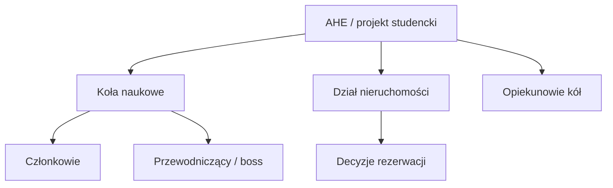
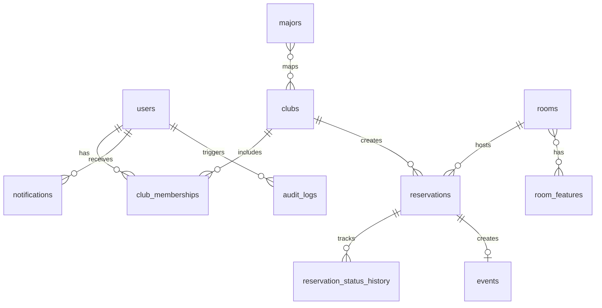
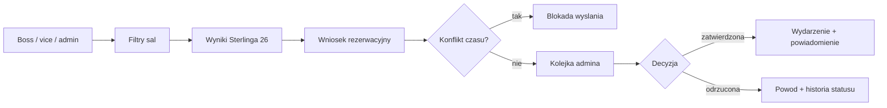

# StudentSpot - raport projektu

## Miejsce uzytkowania

StudentSpot jest nieoficjalnym prototypem studenckim dla aktywnosci kol naukowych i rezerwacji sal w budynku AHE przy ul. Sterlinga 26.



## Problem

Informacje o kolach, wydarzeniach, salach i zgodach moga byc rozproszone. StudentSpot porzadkuje jeden proces:

```text
potrzeba spotkania -> dopasowanie sali -> wniosek -> kontrola konfliktu -> decyzja -> wydarzenie
```

## Role

| Rola | Uprawnienia |
|---|---|
| student | profil, katalog kol, wniosek czlonkowski |
| club_guardian | decyzje czlonkostwa dla swoich kol |
| property_admin | decyzje rezerwacji |
| system_admin | administracja i audyt |
| utw_organizer | rezerwacje dla UTW |
| chair / vice_chair | rezerwacje w imieniu kola |
| member | podglad wydarzen i statusow |

## Dane katalogowe kol AHE

Seed zawiera 13 kol naukowych z oficjalnych podstron AHE. Publiczny katalog pokazuje domyslnie tylko 7 rekordow `active_verified`; 6 rekordow `official_needs_verification` pozostaje w bazie i panelu administratora do potwierdzenia aktualnosci. Nazwiska opiekunow i publiczne e-maile sa przechowywane jako metadane katalogowe, bez tworzenia kont uzytkownikow.

## ERD



## Przeplyw rezerwacji



## Mapa wymagan profesora w aplikacji

Widok `/info` zawiera jawna sekcje "Mapa wymagan projektowych", ktora laczy dzialajaca aplikacje z siedmioma punktami zaliczenia:

1. miejsce uzytkowania i schemat organizacyjny AHE dla projektu,
2. problem, kontekst, zakres, cel, procesy i dokumenty wynikowe,
3. uzytkownicy, role i uprawnienia,
4. zalozenia oraz obiekty zewnetrzne oddzialujace na system,
5. wymagania funkcjonalne,
6. wymagania niefunkcjonalne,
7. projekt koncepcyjny i glowne przeplywy informacyjne.

Sekcja jest dostepna w wersji PL i EN oraz zostala sprawdzona na desktopie, tablecie i telefonie.

## Traceability

| Wymaganie | Modul | Test |
|---|---|---|
| 8 kont demo | `app/cli.py` | `test_demo_seed_uses_eight_accounts_and_sterlinga_only` |
| Tylko Sterlinga 26 | `app/cli.py`, `rooms` | `test_demo_seed_uses_eight_accounts_and_sterlinga_only` |
| PL/EN | `app/i18n.py`, templates | `test_language_switch_changes_interface` |
| Duplikat indeksu/e-maila | `auth.routes` | `test_duplicate_index_and_email_are_rejected` |
| Aktywacja konta | `services.create_activation_token` | `test_registration_activation_flow` |
| Kontrola roli rezerwacji | `security`, `reservations` | `test_student_without_approved_role_cannot_reserve` |
| Wyszukiwanie sal | `services.search_rooms` | `test_room_search_by_capacity_and_features` |
| Konflikt terminow | `services.has_room_conflict` | `test_reservation_conflict_and_boundary_rule` |
| Odrzucenie wymaga powodu | `admin.routes` | `test_admin_rejection_requires_reason` |
| Audyt | `services.audit` | `test_admin_can_approve_membership_and_audit_is_recorded` |
| 13 kol i widocznosc publiczna | `app.cli`, `clubs.routes` | `test_scientific_club_seed_public_visibility_and_hidden_records` |
| Filtry kol i rekomendacje | `clubs.routes`, `main.dashboard` | `test_club_filters_and_dashboard_recommendations` |
| Eksport kalendarza | `reservations.calendar_ics` | `test_approved_meeting_can_be_downloaded_as_ics` |
| Potwierdzenie kol i komunikat UTW | `admin.routes` | `test_admin_can_confirm_hidden_club_and_send_utw_announcement` |
| Mapa wymagan projektowych PL/EN | `main.info`, `translations` | `test_info_page_contains_author_kv_and_project_map`, `test_info_page_professor_map_is_translated_to_english` |
| Rejestracja 2-krokowa i wybor kola | `auth.routes`, `auth/register.html`, `auth/choose_club.html` | `test_registration_activation_flow` |
| Aktualnosci, kalendarz, Local Heroes | `main.routes`, `main/news.html`, `main/calendar.html`, `main/local_heroes.html` | `test_news_calendar_and_local_heroes_pages` |
| Empty state filtrow sal | `rooms/list.html` | `test_room_filters_empty_state_mentions_modernization` |

## Scenariusz demo 5 minut

1. Otworz strone startowa i pokaz logo, PL/EN, dark mode, kontrast i A+.
2. Zaloguj sie jako `boss@studentspot.example.com`, haslo `StudentSpot123!`.
3. Pokaz dashboard, status czlonkostwa i rezerwacje.
4. Przejdz do `/news`, `/calendar` i `/local-heroes`, pokazujac komunikacje kol, sloty rezerwacji i lokalnych ekspertow.
5. Przejdz do `/demo` i pokaz 8 kont, opis projektu oraz tech stack.
6. Przejdz do sal i pokaz filtry Sterlinga 26, dopasowanie do liczby osob, lightbox zdjec oraz watermark przy K200A/K320.
7. Utworz rezerwacje jako boss.
8. Pobierz `.ics` dla zatwierdzonego wydarzenia.
9. Zaloguj sie jako `property@studentspot.example.com` albo `admin@studentspot.example.com`.
10. Zatwierdz albo odrzuc rezerwacje z powodem.
11. Pokaz potwierdzanie ukrytych kol, komunikat UTW, historie statusow, wydarzenie i audyt.

## Wymagania niefunkcjonalne

- Lekki SSR bez React/Next.
- SQLite lokalnie, MySQL przez PyMySQL na Frog.
- CSRF przez Flask-WTF.
- Hashowanie hasel i tokenow aktywacyjnych.
- Brak sekretow w repo.
- Brak zbierania danych medycznych; pola dostepnosci dotycza organizacji wydarzenia.
- Dostepnosc: semantyczne formularze, focus, kontrast, tryb powiekszonej czcionki.

## Znane ograniczenia

- Brak oficjalnej integracji z systemami AHE.
- E-mail w demo dziala przez `ConsoleEmailService`, SMTP wymaga konfiguracji.
- Brak migracji Alembic; MVP uzywa prostego `init-db`.
- Dla istniejacej bazy dodano pomocnicze SQL w `migrations/001_club_catalog_fields.sql` i `migrations/002_user_registration_fields.sql`.
- Dane sal K320/K200A i czesc wyposazenia maja status roboczy.
